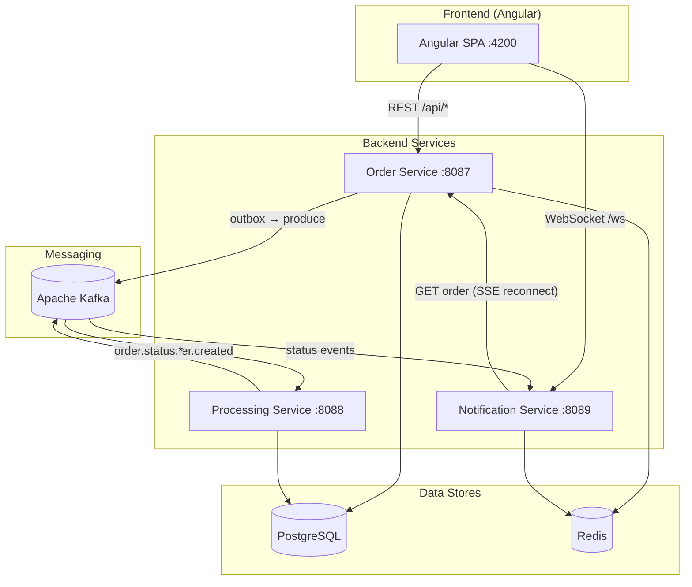

# High-Volume Order Processing Platform

A production-oriented, microservices-based order processing system built with Java 21, Spring Boot 3.x, Apache Kafka, PostgreSQL, Redis, and an Angular 17+ frontend.

---

## Architecture Diagram

High-level architecture: **services**, **messaging**, **database**, **frontend**, and **observability**. A **draw.io** diagram (with Zipkin, Grafana, Prometheus, Glowroot) is in **[docs/architecture.drawio](docs/architecture.drawio)** — open it in [diagrams.net](https://app.diagrams.net/) or VS Code with the Draw.io extension.



**Legend:**

| Layer       | Components                                                                 |
|------------|-----------------------------------------------------------------------------|
| **Frontend** | Angular 17+ SPA (login, dashboard, create order, order detail with live updates). |
| **Services** | Order Service (reactive API, outbox), Processing Service (saga), Notification Service (WebSocket/SSE). |
| **Messaging** | Kafka: `order.created`, `order.status.updated`, `order.shipped`, `order.dlq`. |
| **Database** | PostgreSQL (orders, items, outbox, idempotency, saga state); Redis (cache, rate limit, sessions). |

---

## Design Decisions and Trade-offs

### Messaging choice

**Decision:** Apache Kafka as the event bus.

- **Why:** Durable log, replay, high throughput, clear producer/consumer separation. Order Service publishes only after persisting (outbox); Processing Service consumes and runs the saga; Notification Service consumes status events for real-time push.
- **Trade-off:** More ops complexity (broker, consumer groups). We accept it for at-least-once delivery, DLQ, and scalability. Consumer idempotency (e.g. saga step history) handles duplicates.

### Database choice

**Decision:** Single PostgreSQL instance shared by Order Service (R2DBC) and Processing Service (JPA).

- **Why:** One source of truth for orders and status; no cross-DB sync. ACID for order + outbox + idempotency in one transaction, and for saga step updates.
- **Trade-off:** Schema must suit both reactive and blocking access. We use one schema (`init.sql`) and keep types/naming aligned.

### Communication patterns

**Decision:** Async event-driven between services; sync REST and WebSocket/SSE to the frontend.

- **Why:** Order Service does not call Processing Service over HTTP; it writes to the outbox and a relay publishes to Kafka. Processing and Notification communicate only via Kafka. Frontend uses REST for orders/auth and WebSocket (or SSE) for live status.
- **Trade-off:** Eventual consistency between order state and notifications; we accept short delays for status propagation.

### Caching strategy

**Decision:** Redis for order read cache, rate limiting, idempotency fast path, and WebSocket session registry.

- **Why:** Lower DB load and latency for hot order reads; centralized rate limit and idempotency; session state for notifications.
- **Trade-off:** Short cache TTL and event-driven updates mean brief staleness; we accept that. Redis is a single point of failure for rate limit/idempotency at current scale; replication can be added later.

Detailed write-ups: [Architecture Decision Records (ADRs)](docs/adr/).

---

## Non-Functional Requirement Handling

| Requirement    | How the design addresses it |
|----------------|-----------------------------|
| **Performance** | Reactive Order Service (WebFlux, R2DBC) for non-blocking I/O; Redis cache for `GET /orders/{id}`; Kafka for async processing so the write path stays fast; paginated list endpoint. |
| **Scalability** | Stateless services; Kafka partitions and consumer groups for horizontal scaling; Redis and PostgreSQL can be scaled (replicas, connection pools). Frontend served by nginx; API and WS can sit behind a load balancer. |
| **Resiliency** | Outbox pattern so order + event are consistent; Kafka consumer retries and DLQ for failed messages; circuit breaker (Resilience4j) on Order Service; manual offset commit in Processing Service after saga completion; WebSocket reconnect (e.g. 5s delay) in the frontend. |
| **Observability** | Prometheus metrics from each service (`/actuator/prometheus`); Grafana for dashboards; JSON structured logs and correlation ID; Micrometer Tracing (Brave) in Order Service for distributed traces. |
| **Security** | JWT for API auth; token in memory (no localStorage); AuthGuard and interceptor; 401 → redirect to login; rate limiting per client IP in Redis; CORS configured for the frontend origin. |

---

## Setup Instructions

Follow these steps to run the system locally.

### Option A: Full stack with Docker (recommended)

1. **Prerequisites:** Docker and Docker Compose installed.

2. **Clone/navigate to the project and start everything:**
   ```bash
   cd order-processing-platform
   docker compose up --build
   ```

3. **Access the application:**
- **Frontend:** http://localhost:4200  
- **Order Service API:** http://localhost:8087  
- **Processing Service:** http://localhost:8088  
- **Notification Service:** http://localhost:8089  
- **Eureka (service discovery):** http://localhost:8761 — order-service, processing-service, and notification-service register here.  
- **API Gateway:** http://localhost:8080 — Spring Cloud Gateway; routes `/api/**`, `/ws`, `/sse/**`, `/processing/**` to backends with **Round Robin** load balancing.  
- **Kafka UI:** http://localhost:8090  
- **Prometheus:** http://localhost:9090  
- **Grafana:** http://localhost:3000 (admin / admin) — Prometheus datasource and **Order Platform - Service Statistics** dashboard are provisioned automatically.  
- **Zipkin:** http://localhost:9411 — distributed tracing for inter-service calls and failure investigation.
- **Glowroot (order-service APM):** http://localhost:4000 — transactions, JVM metrics, and traces for the order-service (requires `order-service/glowroot/glowroot.jar`; see [order-service/GLOWROOT.md](order-service/GLOWROOT.md)).

4. **Login (UI):** Use one of these accounts to sign in at the frontend:
   | Username | Password  | Role  |
   |----------|-----------|-------|
   | `admin`  | `admin123`| ADMIN |
   | `user`   | `user123` | USER  |

5. **Swagger UI (OpenAPI):** Interactive API docs are available for each backend service:
   - **Order Service:** http://localhost:8087/swagger-ui.html (or http://localhost:8080/api/swagger-ui.html via Gateway)
   - **Processing Service:** http://localhost:8088/swagger-ui.html (or http://localhost:8080/processing/swagger-ui.html via Gateway)
   - **Notification Service:** http://localhost:8089/swagger-ui.html (Gateway only routes `/ws` and `/sse`; use this URL for Swagger.)
   Order Service endpoints require a JWT: call `POST /auth/token` with `{"username":"admin","password":"admin123"}` and add `Authorization: Bearer <token>` in Swagger’s “Authorize”.

6. **Dashboard (after login):** The UI uses a **TrackNexus-style** dark theme (grid background, accent panels). Once signed in you see:
   - **Header** — logo, live badge, Orders Today / Total from `GET /api/orders/stats`, logout.
   - **Sidebar** — Dashboard, Orders, **Batch / Ingestion** (batch design and validation status).
   - **KPI cards** — Total Orders, Pending Queue, Orders Today, Processing, Shipped (from stats API).
   - **Live Order Stream** — table with filter tabs (All, Pending, Processing, Shipped); columns: Order ID (link to detail), Customer, Status, Amount, Created, View.
   - **Live status updates** — WebSocket updates highlight rows; recent events appear in the right column and in the stream bar.
   - **Pipeline stages** — counts by stage (ingestion, pending, processing, shipped).
   - **Create Order** — dialog to submit a new order; order detail page shows **Order Items** table (product, qty, unit price, line total) and status history timeline.
   - **Batch / Ingestion** — page describing batch design (idempotency, validation); validation status placeholder for future batch runs.

   **End-to-end API test:** Run the full flow (Order → Processing → Notification) with the script: **`./scripts/e2e-flow.sh http://localhost:8080`** (Bash) or **`.\scripts\e2e-flow.ps1`** (PowerShell). For **bulk ingestion (5000+ orders)** to test processing at scale: **`./scripts/bulk-ingest-orders.sh http://localhost:8080 5000 0`** (Bash) or **`.\scripts\bulk-ingest-orders.ps1 -Count 5000`** (PowerShell). To **delete all order data** before a fresh run: **`DOCKER=1 ./scripts/clean-orders.sh`** (Bash, via postgres container) or **`.\scripts\clean-orders.ps1`** (PowerShell). The Order Service rate limit is set to 10000/min in Docker so bulk runs succeed; if you see many failures after ~100 success, see **[API E2E Test — Troubleshooting bulk](docs/API-E2E-Test.md#troubleshooting-bulk-ingestion-many-failures-after-100-success)**.

---

### Option B: Run infrastructure in Docker, services and frontend locally

1. **Start only infrastructure:**
   ```bash
   cd order-processing-platform
   docker compose up -d zookeeper kafka postgres redis prometheus grafana kafka-ui
   ```
   Wait until Postgres and Redis are healthy (e.g. `docker compose ps`).

2. **Start Order Service** (from project root):
   ```bash
   cd order-service
   mvn spring-boot:run
   ```

3. **Start Processing Service** (new terminal):
   ```bash
   cd processing-service
   mvn spring-boot:run
   ```

4. **Start Notification Service** (new terminal):
   ```bash
   cd notification-service
   mvn spring-boot:run
   ```

5. **Start the frontend** (new terminal):
   ```bash
   cd frontend
   npm install --legacy-peer-deps
   npm start
   ```
   Open http://localhost:4200. The dev server proxy forwards `/api` and `/ws` to **http://localhost:8080** (Gateway). So either run the full Docker stack (Gateway + Order/Processing/Notification services) or run Gateway and all three services locally; otherwise you get **503** on login. To point the proxy directly at Order Service (8087) and Notification (8089) instead, edit `frontend/proxy.conf.json`: set `/api` target to `http://localhost:8087` with `"pathRewrite": { "^/api": "" }`, and `/ws` target to `http://localhost:8089`.

---

### Prerequisites (for local runs)

- **Docker & Docker Compose** — for infrastructure and/or full stack.
- **Java 21** — for running Order / Processing / Notification services locally.
- **Maven 3.8+** — for building and running Java services.
- **Node 20+ and npm** — for building and running the Angular frontend.

---

## Project Structure

```
order-processing-platform/
├── init.sql              # PostgreSQL schema (orders, items, outbox, idempotency)
├── prometheus.yml        # Prometheus scrape config for all services
├── docker-compose.yml    # All services + infrastructure
├── eureka-service/       # Eureka Server (service discovery), port 8761
├── gateway-service/      # Spring Cloud Gateway, port 8080; Round Robin routing to backends
├── order-service/        # Reactive; R2DBC, Redis, Kafka outbox, JWT, rate limit; Eureka client
├── processing-service/   # Saga orchestrator, Kafka consumer, DLQ; Eureka client
├── notification-service/ # WebSocket (STOMP), SSE, Kafka consumer; Eureka client
├── frontend/             # Angular 17+, Material, STOMP (nginx proxies /api, /ws, /sse to gateway)
└── docs/
    └── adr/              # Architecture Decision Records
```

---

## API Summary

| Via Gateway | Backend | Description |
|-------------|---------|--------------|
| `GET /api/orders?page&size` | order-service | Paginated order list |
| `GET /api/orders/stats` | order-service | Dashboard stats (total, today, by status, pipeline counts) |
| `GET /processing/stats` | processing-service | Processing status (orders processed today, by status) — via Gateway `/processing/**` |
| `GET /notify-api/stats` | notification-service | Notification stats (WebSocket/SSE connections, events delivered) — via Gateway `/notify-api/**` |
| `GET /api/orders/{id}` | order-service | Order details (with items and status history) |
| `POST /api/orders` | order-service | Create order (idempotent) |
| `POST /api/auth/token` | order-service | JWT login (admin/admin123, user/user123) |
| `/ws`, `/ws/**` | notification-service | WebSocket (STOMP); subscribe `/topic/orders/{id}` |
| `GET /sse/orders/{id}` | notification-service | SSE for order updates |
| `/processing/**` | processing-service | Processing endpoints (e.g. actuator) |

Traffic to the gateway (port 8080) is load-balanced with **Round Robin** across instances registered in Eureka.

---

## Configuration

- **Order Service:** R2DBC URL, Redis host/port, Kafka bootstrap, JWT secret, rate limit (`RATE_LIMIT_REQUESTS_PER_MINUTE`), idempotency TTL.
- **Processing Service:** JDBC URL, Kafka bootstrap, consumer group, manual commit, DLQ topic.
- **Notification Service:** Kafka bootstrap, Redis (session store), Order Service URL for SSE reconnect.
- **Frontend (Docker):** Nginx proxies `/api` to Order Service and `/ws` to Notification Service.

---

## Observability

- **Metrics:** Prometheus scrapes `/actuator/prometheus` from each Java service (ports 8087, 8088, 8089). **Grafana** is preconfigured with a Prometheus datasource and an **Order Platform - Service Statistics** dashboard (orders created, HTTP rates, DLQ, notifications, WebSocket connections) under the *Order Platform* folder.
- **Logging:** JSON (Logback) with correlation ID where applicable.
- **Tracing:** **Zipkin** is used for distributed tracing across Order, Processing, and Notification services.
- **APM (order-service):** **Glowroot** for slow-call and JVM tracking. Agent path: `order-service/glowroot/glowroot.jar`. Use Maven profile `-Pglowroot` for local run (UI at http://localhost:4000). In Docker, the agent is enabled when the JAR is present; open **http://localhost:4000** for the Glowroot UI (see [order-service/GLOWROOT.md](order-service/GLOWROOT.md)). All three services send spans to Zipkin (Brave + `zipkin-reporter-brave`). Use Zipkin’s UI to trace requests and debug inter-service communication failures. Sampling is set to 1.0 when running with the default config.

---

## Failure scenarios

How the system behaves when things go wrong (messaging down, DB failure, service crash, duplicates, etc.) is described in **[Failure-Scenarios.md](docs/Failure-Scenarios.md)**. Each scenario states whether it is **handled in code** and points to the relevant classes.

---

## Architecture Decision Records

Detailed ADRs in [docs/adr/](docs/adr/):

- [ADR-001: Messaging choice (Kafka)](docs/adr/ADR-001-messaging-choice.md)
- [ADR-002: Database choice (PostgreSQL)](docs/adr/ADR-002-database-choice.md)
- [ADR-003: Communication patterns](docs/adr/ADR-003-communication-patterns.md)
- [ADR-004: Caching strategy](docs/adr/ADR-004-caching-strategy.md)
- [ADR-005: Architecture style](docs/adr/ADR-005-architecture-style.md)

---

## Troubleshooting

- **Data not persisting / orders disappear after restart:** Postgres data is stored in a **named volume** `pgdata` so it survives container restarts. Ensure `docker-compose.yml` includes `volumes: pgdata:/var/lib/postgresql/data` under the postgres service and a top-level `volumes: pgdata:`. After adding this, run `docker compose down` then `docker compose up -d` (do **not** use `docker compose down -v` in normal use, or you will delete the volume and lose data). If you previously ran without the named volume, the first time you bring the stack up with the new config you will get a fresh database; from then on, data will persist.
- **Order-service not in Eureka:** The service must start successfully to register. Docker runs order-service with the Glowroot agent when `order-service/glowroot/glowroot.jar` is present; if the JAR is missing, the JVM will fail on startup and never register. To disable Glowroot in Docker, comment out `JAVA_TOOL_OPTIONS` and the glowroot volume in the order-service section of docker-compose.yml.
- **Kafka logs “Invalid receive (size = … larger than 104857600)”:** This usually means something is sending HTTP (or other non-Kafka protocol) to Kafka’s port 9092—e.g. opening `http://localhost:9092` in a browser or a misconfigured health check. Use the Kafka protocol only (e.g. `kafka-broker-api-versions`); the broker is fine, the client connecting is wrong.
- **503 on login or no dashboard after login:** The frontend proxy targets the Gateway (http://localhost:8080). Ensure Gateway and Order Service are running. If you see **`global is not defined`** in the console, refresh after pulling the latest frontend (a `global` polyfill was added in `main.ts`).
- **Create Order fails with "Row with Id [...] does not exist":** This occurred when the service used `save()` for new orders; new orders now use `insert()` so the row is created. Rebuild and restart the order-service.
- **BeanPostProcessorChecker / LoadBalancer "not eligible for getting processed by all BeanPostProcessors":** These are benign warnings from Spring Cloud LoadBalancer when used with Eureka in a reactive app. They do not affect runtime behavior and can be ignored.

---

## License

Internal / educational use.
